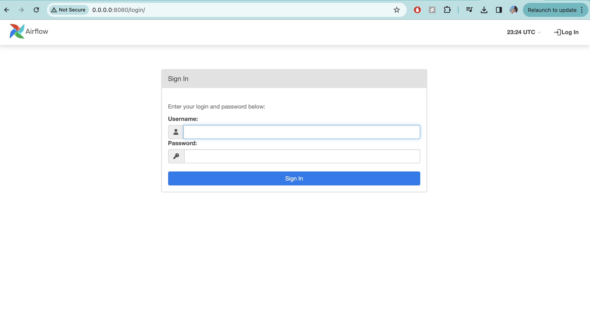
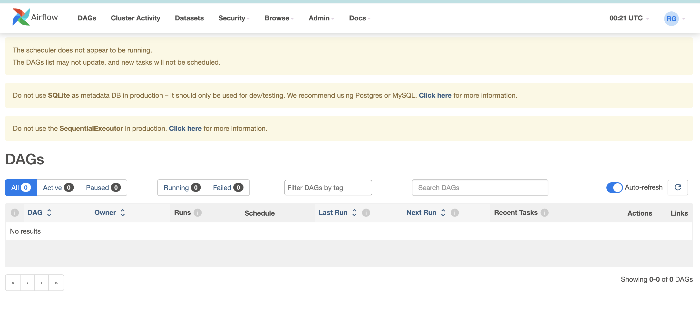
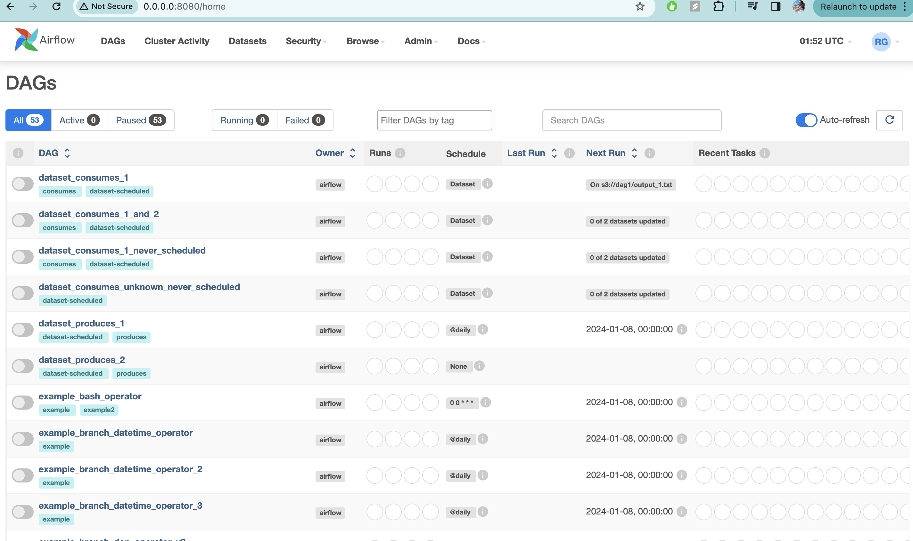

# BigData_Airflow

# AIRFLOW

Download necessities in VS code through Airflow official github : https://github.com/apache/airflow?tab=readme-ov-file#installing-from-pypi

click on: Installing from PyPI

Open VSCODE project:

1. create python env 
`
python3 -m venv py_env
`
`
source py_env/bin/activate
`

2. export aiflow to current project directory
`
export AIRFLOW_HOME=.
``

3. Intialize airflow database
`
airflow db init    #logs will be created with SQLite database
`
4. For webserver configurations

- Make sure for :Open your Airflow configuration file, which is typically named airflow.cfg.

    sql_alchemy_conn = sqlite:///./airflow.db

- Change the relative path to an absolute path, for example:

    sql_alchemy_conn = sqlite:////absolute/path/to/your/airflow.db

Replace /absolute/path/to/your/airflow.db with the actual absolute path where you want to store your Airflow database.

Save the configuration file.
Then RUN webserver in terminal
`
airflow webserver -p 8080  #port 8080
`

5. Set Username and Password for the web server
 `
 airflow users create --username admin --firstname Rasika --lastname Gulhane --role Admin --email gulhanerasika@gmail.com
 `
 set password:
 `
 password 
 `
 Run the webserver again and follow the link and try sign in

 

6. open another terminal

repeat step 2 for scheduler connection 

Then initialize scheduler 

`
airflow scheduler
`

- Checkall scheduler
`
ps aux | grep "airflow scheduler"
`
open webserver to see if scheduler is running (it will remove the pop up message of scheduler not running

